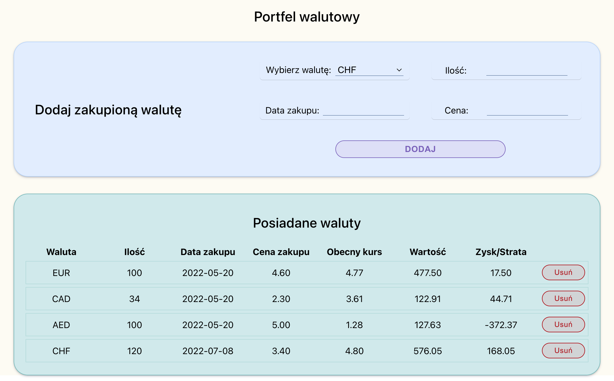

# Currency Wallet - React

## Table of Contents
1. [About the project](#about-the-project)
2. [How to see it](#how-to-see-it)
3. [Technologies](#technologies)
4. [Solutions](#solutions)
5. [Development](#development)
6. [Project preview](#project-preview)
7. [Contact](#feel-free-to-contact-me)
8. [Sources](#sources)
9. [Thanks](#thanks-for-project-and-support-to-Mateusz-Bogolubow)

## About the project
The aim of the project was to create application "Currency Wallet" which calculate profit or loss owned currencies. Application has a feature, which allows to add a new currency by using a form. After added a new currency, use will see it in a table. Actual rate is fetching by using API (apilayer.com). User can remove picked currency, as well. The data in form are validated. After refreshing a page (for example next day) the actual rate will be check again.

I used Redux to manage the state. I created two modules:
1. exchange API - a module (store) for data from API
2. wallet - a module (store) for data in localStorage

I combied stores using combineReducers helper function.

```
const rootReducers = combineReducers({
    wallet:walletReductor,
    exchange:exchageReductor
})
```

Column names, inputs and currency data are stored in json files, so it is easy to manage it.

While undertaking this project, to key was to create each element in that way to possible use it in another application, so I tried to do it.


## How to see it
I have prepared a short video, to show how my application works. Please click the link below. You can check the screenshot, which are attached below, as well.
* [Currency Wallet - React | Ewelina Kopacz](https://www.awesomescreenshot.com/video/9931403?key=5d52dfedf4045f27a46d20fb8ebeecfd)

## Technologies:
* JavaScript
* React
* Redux
* HTML
* CSS
* Desktop only version

## Solutions
When creating this project I had an opportunity to learn/practice :
* flux archtecture: patterns: "the observer pattern"
* redux:
    * store
    * actions
    * reducers
    * provider
    * combine reducers
    * thunk and API
    * Redux DevTools extension
* correct splitting code into files

### Development
I am going to develop application by adding additional functionalities such as:
* fetching the rate automatically based on date of buy, and a user will keep possibility to change the rate
* confirmation component before remove a currency

### Project preview
Currency wallet


### Feel free to contact me:
* [Linkedin](https://www.linkedin.com/in/ewelina-kopacz-929559100/) - Ewelina Kopacz

### Sources:
* [How to persist Redux state in local Storage](https://www.geeksforgeeks.org/how-to-persist-redux-state-in-local-storage-without-any-external-library/)
* [Redux Thunk w aplikacjach React](https://frontstack.pl/redux-thunk-w-aplikacjach-react/)
* [Immutability in React and Redux](https://daveceddia.com/react-redux-immutability-guide/)
* [A Simple Explanation on Updating Redux Store](https://levelup.gitconnected.com/a-simple-explanation-on-updating-redux-store-8e9bc6c8e279)

### Thanks for project and support to Mateusz Bogolubow:
* Mentor i Trener Programowania JavaScript - [DevMentor](https://devmentor.pl/) - Mateusz Bogolubow